# Whiteboard Skills Refactor Implementation Plan

> **For Claude:** REQUIRED SUB-SKILL: Use superpowers:executing-plans to implement this plan task-by-task.

**Goal:** Refactor whiteboard skills to use natural language as intermediate format with clear separation between I/O, Excalidraw conversion, and PlantUML conversion.

**Architecture:** Three skills with distinct responsibilities: whiteboard (I/O), excalidraw (NL ↔ JSON bidirectional), plantuml (PlantUML ↔ NL bidirectional). Natural language serves as universal intermediate format that users can inspect and edit.

**Tech Stack:** Claude Code skills (markdown with frontmatter), Excalidraw JSON, PlantUML syntax

---

### Task 1: Create whiteboard.md (I/O skill)

**Files:**
- Create: `plugin/skills/whiteboard/whiteboard.md`

**Step 1: Create the whiteboard skill file**

Create `plugin/skills/whiteboard/whiteboard.md` with this content:

```markdown
---
name: whiteboard:whiteboard
description: Use when user wants to interact with a whiteboard
model: haiku
---

# Whiteboard I/O Skill

Pure I/O operations for the whiteboard canvas server. Connect, read, write, savepoints.

**This skill handles:**
- Connecting to whiteboard servers
- Reading canvas content
- Writing/updating canvas content
- Managing savepoints

**This skill does NOT handle:**
- Format conversion (use whiteboard:excalidraw)
- PlantUML parsing (use whiteboard:plantuml)

## Connecting

When user asks to connect to a whiteboard:

1. Extract the URL (e.g., http://localhost:3000)
2. Verify connection:
   ```bash
   curl -s {URL}/health
   ```
3. If successful, fetch session info:
   ```bash
   curl -s {URL}/api/session
   ```
4. Remember the URL for subsequent operations
5. Tell user: "Connected to '{session.name}' at {URL}"

## Reading Canvas

When user asks what's on the canvas or needs current state:

```bash
curl -s {URL}/api/canvas
```

Returns JSON with `elements` array. Summarize what's there rather than dumping raw JSON unless asked.

## Updating Canvas

### Full Replace (when regenerating everything)

```bash
curl -s -X PUT {URL}/api/canvas \
  -H "Content-Type: application/json" \
  -d '{"elements": [...]}'
```

### Adding Elements (preferred for incremental work)

1. Get current canvas
2. Append new element(s) to the elements array
3. Set the updated canvas

### Updating Specific Elements

1. Get current canvas
2. Find element by id
3. Modify properties
4. Set the updated canvas

### Deleting Elements

1. Get current canvas
2. Filter out element(s) by id
3. Set the updated canvas

## Savepoints

### Create savepoint

```bash
curl -s -X POST {URL}/api/savepoints \
  -H "Content-Type: application/json" \
  -d '{"name": "checkpoint-name"}'
```

### List savepoints

```bash
curl -s {URL}/api/savepoints
```

### Rollback to savepoint

```bash
curl -s -X POST {URL}/api/savepoints/{name}
```

## Guidelines

1. **Always connect first** - Verify health before any operation
2. **Preserve existing elements** - When adding, always get current state first
3. **Generate unique IDs** - Use format: `{type}-{timestamp}-{random4chars}`
4. **Summarize, don't dump** - Describe canvas contents in natural language
5. **Create savepoints before big changes** - Suggest this to user proactively
6. **Use dangerouslyDisableSandbox** - All curl commands need sandbox disabled for localhost access
```

**Step 2: Verify file was created**

Run: `ls -la plugin/skills/whiteboard/whiteboard.md`
Expected: File exists with correct permissions

**Step 3: Commit**

```bash
git add plugin/skills/whiteboard/whiteboard.md
git commit -m "feat: create whiteboard.md I/O skill"
```

---

### Task 2: Create excalidraw.md (bidirectional converter)

**Files:**
- Create: `plugin/skills/whiteboard/excalidraw.md`

**Step 1: Create the excalidraw skill file**

Create `plugin/skills/whiteboard/excalidraw.md` with this content:

```markdown
---
name: whiteboard:excalidraw
description: Use when user wants to convert to or from Excalidraw format
model: opus
---

# Excalidraw Converter Skill

Bidirectional conversion between natural language descriptions and Excalidraw JSON.

**This skill handles:**
- Natural language → Excalidraw JSON
- Excalidraw JSON → Natural language description

**This skill does NOT handle:**
- Whiteboard I/O (use whiteboard:whiteboard)
- PlantUML conversion (use whiteboard:plantuml)

## Before You Generate

**BEFORE GENERATING ANY ELEMENTS: Read the Excalidraw spec:**
- [EXCALIDRAW-SPEC.md](EXCALIDRAW-SPEC.md) - Element structure, bindings, JSON format

| If you think...       | Reality                                                    |
|-----------------------|------------------------------------------------------------|
| "User said skip docs" | Invalid JSON wastes their time. Read the spec.             |
| "It's urgent"         | Reading spec: 30 sec. Debugging broken JSON: 5 min.        |
| "I know Excalidraw"   | Training data is outdated. This spec is authoritative.     |

## Direction Detection

Analyze the input to determine conversion direction:

**Natural Language → Excalidraw JSON when:**
- Input is a description of a process, diagram, or visual
- User asks to "convert to excalidraw" or "generate diagram"
- Input contains no Excalidraw JSON structure

**Excalidraw JSON → Natural Language when:**
- Input contains Excalidraw elements array
- User asks to "describe" or "explain" the diagram
- User asks to "convert to natural language"

## Natural Language → Excalidraw JSON

### Diagram Type Detection

Analyze the input to determine diagram type:

| Keywords/Patterns | Diagram Type | Styling |
|-------------------|--------------|---------|
| process, workflow, activity, swimlane, flow, steps, actors | Activity/Swimlane | Use swimlane styling |
| class, interface, inheritance, methods, properties | Class diagram | Generic styling |
| sequence, message, call, response | Sequence diagram | Generic styling |
| state, transition, event | State diagram | Generic styling |
| Other | Generic diagram | Generic styling |

### Swimlane Styling (Activity/Process Diagrams)

Use this styling for process flows, workflows, and activity diagrams:

**Structure:**
- Vertical swimlane format
- Top-to-bottom flow direction
- Swimlane headers at top identifying actors/systems/stages
- Process boxes in lanes with matching colors
- Straight arrows connecting steps with bound labels

**Headers:**
- Position: y=50, height=50
- Lane spacing: ~220px horizontal
- Style: strokeWidth=2, roughness=0, roundness={type:3}
- Must have bound text element for the label

**Color Palette (use consistently per lane):**

| Lane   | Stroke  | Header Fill | Box Fill (lighter) |
|--------|---------|-------------|-------------------|
| Blue   | #1971c2 | #a5d8ff     | #e7f5ff           |
| Green  | #2f9e44 | #b2f2bb     | #ebfbee           |
| Yellow | #f08c00 | #ffec99     | #fff9db           |
| Red    | #e03131 | #ffc9c9     | #fff5f5           |
| Purple | #9c36b5 | #eebefa     | #f8f0fc           |
| Teal   | #0c8599 | #99e9f2     | #e3fafc           |
| Pink   | #d6336c | #fcc2d7     | #fff0f6           |
| Gray   | #495057 | #dee2e6     | #f8f9fa           |

Assign colors to lanes in order of appearance. Use semantic grouping when obvious (e.g., user-facing=blue, backend=green, external services=yellow).

**Process Boxes:**
- Size: 200x70 typical
- First row: y=140
- Row spacing: ~120px vertical
- Style: same strokeColor as lane header, lighter backgroundColor

**Critical: Boxes must declare ALL bound elements:**

```json
{
  "type": "rectangle",
  "strokeColor": "#1971c2",
  "backgroundColor": "#e7f5ff",
  "boundElements": [
    {"id": "box-text-id", "type": "text"},
    {"id": "incoming-arrow-id", "type": "arrow"},
    {"id": "outgoing-arrow-id", "type": "arrow"}
  ]
}
```

**Arrow Binding (Bidirectional - REQUIRED):**

For arrows to stay connected when dragging, binding must be declared on BOTH sides:

1. Box declares arrow in its `boundElements` array
2. Arrow declares box in `startBinding` and `endBinding`

```json
{
  "type": "arrow",
  "roundness": null,
  "points": [[0, 0], [dx, dy]],
  "startBinding": {"elementId": "source-box-id", "focus": 0, "gap": 1},
  "endBinding": {"elementId": "target-box-id", "focus": 0, "gap": 1},
  "boundElements": [{"id": "label-id", "type": "text"}],
  "endArrowhead": "arrow"
}
```

**Arrow Labels:**
```json
{
  "type": "text",
  "containerId": "arrow-id",
  "text": "webhook",
  "fontSize": 14,
  "textAlign": "center",
  "verticalAlign": "middle"
}
```

### Generic Styling (Non-Activity Diagrams)

For class diagrams, sequence diagrams, and other types:
- Use default Excalidraw colors (#1e1e1e stroke, light backgrounds)
- No swimlane structure
- Appropriate shapes for diagram type (rectangles for classes, etc.)

### Output Format

Output the raw JSON directly to chat - no markdown code fences, no explanation, just the JSON.

## Excalidraw JSON → Natural Language

When converting from Excalidraw JSON to natural language:

1. Parse the elements array
2. Identify diagram structure (swimlanes, connections, groupings)
3. Extract text content from shapes
4. Describe the flow/relationships in plain English
5. Output a clear, structured description that could be used to recreate the diagram

Example output format:
```
This is a swimlane activity diagram with 3 actors: User, API Server, Database.

Flow:
1. User submits form (User lane)
2. API validates request (API Server lane)
3. API queries database (arrow: "SQL query" → Database lane)
4. Database returns results (arrow: "result set" → API Server lane)
5. API formats response (API Server lane)
6. Response sent to user (arrow: "JSON" → User lane)
```
```

**Step 2: Verify file was created**

Run: `ls -la plugin/skills/whiteboard/excalidraw.md`
Expected: File exists with correct permissions

**Step 3: Commit**

```bash
git add plugin/skills/whiteboard/excalidraw.md
git commit -m "feat: create excalidraw.md bidirectional converter skill"
```

---

### Task 3: Create PLANTUML-SPEC.md

**Files:**
- Create: `plugin/skills/whiteboard/PLANTUML-SPEC.md`

**Step 1: Create the PlantUML spec file**

Create `plugin/skills/whiteboard/PLANTUML-SPEC.md` with this content:

```markdown
# PlantUML Syntax Specification

Reference for parsing and generating PlantUML diagrams.

## Activity Diagrams (New Syntax)

### Basic Structure

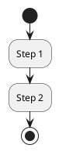

### Swimlanes

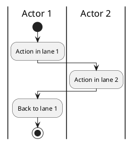

### Conditionals

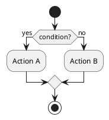

### Parallel (Fork/Join)

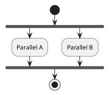

### Repeat/While Loops

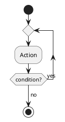

### Notes

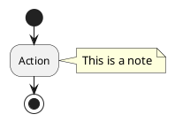

## Class Diagrams

### Basic Class

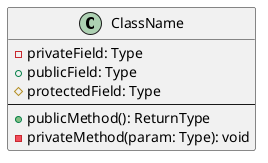

### Relationships

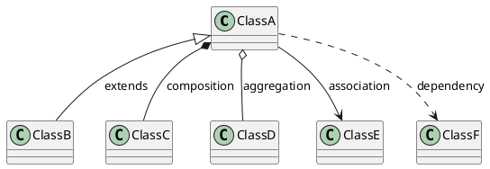

### Interfaces

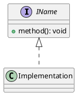

## Sequence Diagrams

### Basic Messages

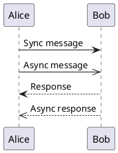

### Lifelines and Activation

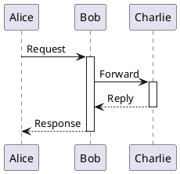

### Notes

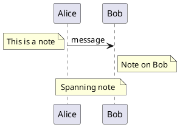

## State Diagrams

### Basic States

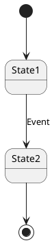

### Composite States

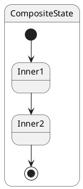

## Parsing Tips

When converting PlantUML to natural language:

1. **Identify diagram type** from `@startuml` block content
2. **Extract actors/participants** from declarations or swimlane markers
3. **Parse flow** by following arrows and control structures
4. **Capture labels** from arrow annotations and notes
5. **Preserve relationships** (inheritance, composition, etc.)

## Generation Tips

When converting natural language to PlantUML:

1. **Choose appropriate diagram type** based on description
2. **Identify actors/classes/states** from the description
3. **Map flow steps** to PlantUML syntax
4. **Add appropriate styling** (colors, notes) when specified
5. **Use proper arrow types** for relationship semantics
```

**Step 2: Verify file was created**

Run: `ls -la plugin/skills/whiteboard/PLANTUML-SPEC.md`
Expected: File exists with correct permissions

**Step 3: Commit**

```bash
git add plugin/skills/whiteboard/PLANTUML-SPEC.md
git commit -m "docs: create PLANTUML-SPEC.md reference"
```

---

### Task 4: Create plantuml.md skill

**Files:**
- Create: `plugin/skills/whiteboard/plantuml.md`

**Step 1: Create the plantuml skill file**

Create `plugin/skills/whiteboard/plantuml.md` with this content:

```markdown
---
name: whiteboard:plantuml
description: Use when user wants to convert to or from PlantUML format
model: opus
---

# PlantUML Converter Skill

Bidirectional conversion between PlantUML syntax and natural language descriptions.

**This skill handles:**
- PlantUML → Natural language description
- Natural language description → PlantUML

**This skill does NOT handle:**
- Excalidraw conversion (use whiteboard:excalidraw)
- Whiteboard I/O (use whiteboard:whiteboard)

## Before You Generate

**BEFORE GENERATING ANY PLANTUML: Read the PlantUML spec:**
- [PLANTUML-SPEC.md](PLANTUML-SPEC.md) - Syntax for activity, class, sequence, state diagrams

## Direction Detection

Analyze the input to determine conversion direction:

**PlantUML → Natural Language when:**
- Input contains `@startuml` / `@enduml` markers
- Input uses PlantUML syntax (`:action;`, `-->`, `|lane|`, etc.)
- User asks to "describe" or "explain" the PlantUML

**Natural Language → PlantUML when:**
- Input is a description of a process or diagram
- User asks to "convert to PlantUML" or "generate PlantUML"
- Input contains no PlantUML syntax

## PlantUML → Natural Language

When converting PlantUML to natural language:

1. **Identify diagram type** (activity, class, sequence, state)
2. **Extract participants/actors** from declarations or swimlanes
3. **Trace the flow** following arrows and control structures
4. **Capture all labels** from arrows, notes, and descriptions
5. **Output structured description** that preserves all semantics

### Output Format

```
Diagram Type: [Activity/Class/Sequence/State]

Participants/Actors:
- Actor 1: [role/description]
- Actor 2: [role/description]

Flow/Structure:
1. [First step/element]
2. [Second step/element]
   - [Sub-detail if conditional/branch]
3. [Third step/element]

Relationships:
- [A] → [B]: [description]
- [C] inherits [D]

Notes:
- [Any notes or annotations from the diagram]
```

## Natural Language → PlantUML

When converting natural language to PlantUML:

1. **Determine best diagram type** from the description:
   - Process/workflow/steps → Activity diagram
   - Classes/objects/methods → Class diagram
   - Messages/calls/responses → Sequence diagram
   - States/transitions → State diagram

2. **Extract actors/entities** and their roles

3. **Map to PlantUML syntax** using appropriate constructs

4. **Output valid PlantUML** wrapped in markers

### Output Format

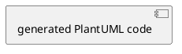

## Examples

### PlantUML → Natural Language

Input:
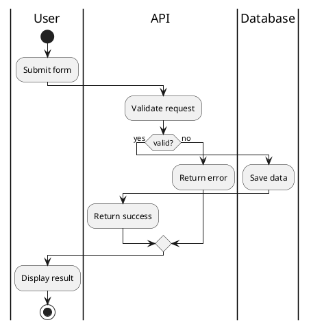

Output:
```
Diagram Type: Activity (Swimlane)

Actors:
- User: End user interacting with the system
- API: Backend service handling requests
- Database: Data persistence layer

Flow:
1. User submits form (User)
2. API validates the request (API)
3. If valid:
   a. Database saves the data (Database)
   b. API returns success (API)
4. If invalid:
   a. API returns error (API)
5. User displays result (User)
```

### Natural Language → PlantUML

Input:
```
A checkout process where the customer adds items to cart,
proceeds to checkout, enters payment details.
The payment service validates the card, charges it,
and if successful the order service creates the order
and sends confirmation email.
```

Output:
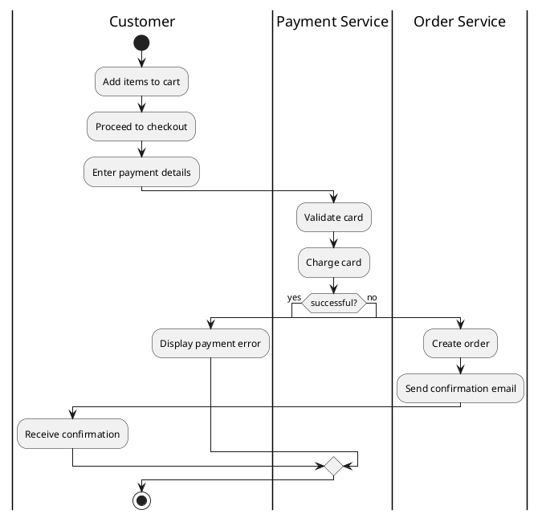
```

**Step 2: Verify file was created**

Run: `ls -la plugin/skills/whiteboard/plantuml.md`
Expected: File exists with correct permissions

**Step 3: Commit**

```bash
git add plugin/skills/whiteboard/plantuml.md
git commit -m "feat: create plantuml.md bidirectional converter skill"
```

---

### Task 5: Delete old skill files

**Files:**
- Delete: `plugin/skills/whiteboard/canvas.md`
- Delete: `plugin/skills/whiteboard/activity.md`

**Step 1: Delete canvas.md**

Run: `rm plugin/skills/whiteboard/canvas.md`

**Step 2: Delete activity.md**

Run: `rm plugin/skills/whiteboard/activity.md`

**Step 3: Verify files are deleted**

Run: `ls -la plugin/skills/whiteboard/`
Expected: Only `whiteboard.md`, `excalidraw.md`, `plantuml.md`, `EXCALIDRAW-SPEC.md`, `PLANTUML-SPEC.md`

**Step 4: Commit**

```bash
git add -A plugin/skills/whiteboard/
git commit -m "refactor: remove deprecated canvas.md and activity.md skills"
```

---

### Task 6: Update plugin metadata

**Files:**
- Modify: `plugin/.claude-plugin/plugin.json`
- Modify: `.claude-plugin/marketplace.json`

**Step 1: Update plugin.json**

Edit `plugin/.claude-plugin/plugin.json`:

```json
{
  "name": "whiteboard",
  "description": "Whiteboard plugin for Claude Code - canvas operations and diagram generation",
  "version": "0.11.0",
  "author": {
    "name": "Kristof Sajdak"
  },
  "repository": "https://github.com/kristofsajdak/claude-whiteboard",
  "license": "MIT",
  "keywords": ["canvas", "whiteboard", "excalidraw", "collaboration", "drawing", "diagrams", "swimlane", "activity", "workflow", "plantuml", "natural language"]
}
```

**Step 2: Update marketplace.json**

Edit `.claude-plugin/marketplace.json`:

```json
{
  "name": "claude-whiteboard",
  "description": "Collaborative AI-powered whiteboard for Claude Code",
  "owner": {
    "name": "Kristof Sajdak"
  },
  "plugins": [
    {
      "name": "whiteboard",
      "source": "./plugin",
      "description": "Whiteboard plugin for Claude Code - canvas operations and diagram generation",
      "version": "0.11.0"
    }
  ]
}
```

**Step 3: Verify changes**

Run: `cat plugin/.claude-plugin/plugin.json && cat .claude-plugin/marketplace.json`
Expected: Both files show version 0.11.0 and updated keywords

**Step 4: Commit**

```bash
git add plugin/.claude-plugin/plugin.json .claude-plugin/marketplace.json
git commit -m "chore: bump version to 0.11.0, add plantuml and natural language keywords"
```

---

### Task 7: Final verification

**Files:**
- Verify: All skill files in `plugin/skills/whiteboard/`

**Step 1: List all skill files**

Run: `ls -la plugin/skills/whiteboard/`
Expected:
- `whiteboard.md` (I/O skill)
- `excalidraw.md` (NL ↔ Excalidraw)
- `plantuml.md` (PlantUML ↔ NL)
- `EXCALIDRAW-SPEC.md` (spec reference)
- `PLANTUML-SPEC.md` (spec reference)

**Step 2: Verify skill frontmatter**

Run: `head -5 plugin/skills/whiteboard/whiteboard.md plugin/skills/whiteboard/excalidraw.md plugin/skills/whiteboard/plantuml.md`
Expected: Each file has correct `name:` and `description:` in frontmatter

**Step 3: Check git status**

Run: `git status`
Expected: Clean working tree

**Step 4: View commit history**

Run: `git log --oneline -10`
Expected: 6 new commits for this refactor

---

## Summary

| Task | Description | Files |
|------|-------------|-------|
| 1 | Create whiteboard.md | +1 file |
| 2 | Create excalidraw.md | +1 file |
| 3 | Create PLANTUML-SPEC.md | +1 file |
| 4 | Create plantuml.md | +1 file |
| 5 | Delete old files | -2 files |
| 6 | Update metadata | 2 files modified |
| 7 | Verify | 0 changes |

**Final state:** 5 files in `plugin/skills/whiteboard/`, version 0.11.0
