# PlantUML Syntax Specification

Reference for parsing and generating PlantUML diagrams.

## Activity Diagrams (New Syntax)

### Basic Structure

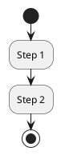

### Swimlanes

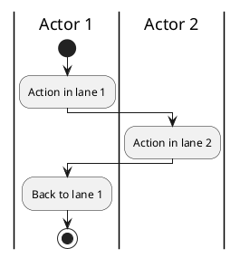

### Conditionals

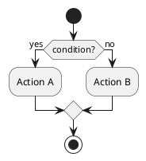

### Parallel (Fork/Join)

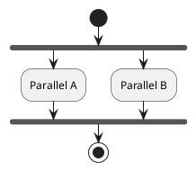

### Repeat/While Loops

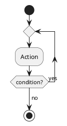

### Notes

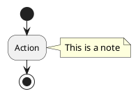

## Class Diagrams

### Basic Class

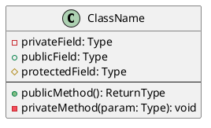

### Relationships

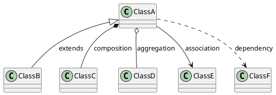

### Interfaces

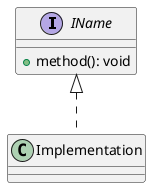

## Sequence Diagrams

### Basic Messages

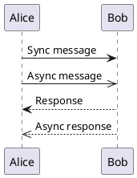

### Lifelines and Activation

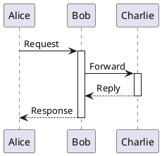

### Notes

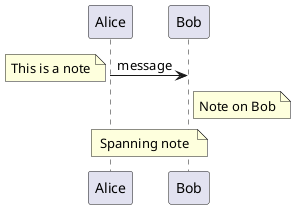

## State Diagrams

### Basic States

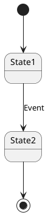

### Composite States

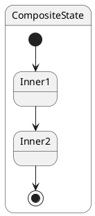

## Parsing Tips

When converting PlantUML to natural language:

1. **Identify diagram type** from `@startuml` block content
2. **Extract actors/participants** from declarations or swimlane markers
3. **Parse flow** by following arrows and control structures
4. **Capture labels** from arrow annotations and notes
5. **Preserve relationships** (inheritance, composition, etc.)

## Generation Tips

When converting natural language to PlantUML:

1. **Choose appropriate diagram type** based on description
2. **Identify actors/classes/states** from the description
3. **Map flow steps** to PlantUML syntax
4. **Add appropriate styling** (colors, notes) when specified
5. **Use proper arrow types** for relationship semantics
