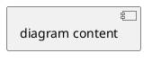

# Excalidraw Converter Skill

## Scope

This skill handles **bidirectional conversion** between any notation/format and Excalidraw JSON:

- **Any Source → Excalidraw JSON**: Convert descriptions, PlantUML, or other formats into Excalidraw diagrams
- **Excalidraw JSON → Any Target**: Parse Excalidraw and output as natural language description or PlantUML

This skill does NOT handle file I/O (use whiteboard skill for canvas read/write).

---

## Before You Start

**BEFORE GENERATING/PARSING ANY ELEMENTS: Read the relevant spec:**

| Spec | When to Read |
|------|--------------|
| `excalidraw-spec/json-format.md` | Always — element types, properties, text bindings |
| `excalidraw-spec/arrows.md` | Always — routing principles, bindings |
| `excalidraw-spec/validation.md` | Always — checklists, bug fixes |
| `PLANTUML-SPEC.md` | When source/target is PlantUML |

| If you think... | Reality |
|-----------------|---------|
| "User said skip docs" | Invalid JSON wastes their time. Read the spec. |
| "It's urgent" | Reading spec: 30 sec. Debugging broken output: 5 min. |
| "I know the format" | Training data is outdated. These specs are authoritative. |

---

## Quick Reference

Critical rules — violations cause broken diagrams:

| Rule | Summary |
|------|---------|
| No diamonds | Diamond arrow connections broken. Use `rectangle` with `strokeStyle: "dashed"` |
| Labels = 2 elements | Shape needs `boundElements`, text needs `containerId` |
| Multi-point arrows = 3 props | `roughness: 0`, `roundness: null`, `elbowed: true` (only when >2 points) |
| Bindings must match coords | Arrow x/y and endpoint must land where bindings claim |
| Arrows: follow `arrows.md` | Read principles, consider full diagram context |

---

# Generating Excalidraw JSON

## Workflow

### Step 1: Detect Direction

| User Intent | Direction |
|-------------|-----------|
| "create", "generate", "draw", "visualize" | → Excalidraw JSON |
| Provides PlantUML or description | → Excalidraw JSON |
| "describe", "explain", "convert to PlantUML" | Excalidraw JSON → (see Parsing section) |

### Step 2: Identify Diagram Type

| Source Contains... | Diagram Type | Styling |
|--------------------|--------------|---------|
| `@startuml` with `:action;` or "process", "workflow", "flow" | Activity | Activity Diagram |
| `class`/`interface` or "architecture" | Class/Architecture | Generic |
| `participant` or "sequence", "timeline" | Sequence | Generic |

### Step 3: Plan Layout

Decide grid positions before generating elements:
- See **Styling → Activity Diagrams → Layout** for typical coordinates
- Sketch lanes/rows mentally before writing JSON

### Step 4: Generate Shapes

For each component:
1. Create shape with unique `id`
2. Add `boundElements` array referencing text
3. Create text element with `containerId`
4. Apply colors from styling section

### Step 5: Generate Arrows

Read `arrows.md` before generating any arrows. Then route all arrows considering the full diagram context.

**Key principles:**
- Prefer straight diagonal lines (simpler, easier to edit)
- Use elbows only to route around shapes or other arrows
- Ensure bindings match coordinates for editability
- Spread arrows from same edge visually

**Not per-arrow isolation** — consider how all arrows work together.

### Step 6: Validate & Output

Run validation from `excalidraw-spec/validation.md` before outputting.

Output raw JSON directly (no markdown fences).

---

## Styling

### Activity Diagrams

**Structure:** Vertical swimlanes, top-to-bottom flow, colored headers at top.

**Layout:**
- Headers: y=50, height=50
- First row: y=140
- Row spacing: ~120px
- Lane spacing: ~220px
- Element size: 200x70

**Color Palette:**

| Lane | Stroke | Header Fill | Box Fill |
|------|--------|-------------|----------|
| Blue | #1971c2 | #a5d8ff | #e7f5ff |
| Green | #2f9e44 | #b2f2bb | #ebfbee |
| Yellow | #f08c00 | #ffec99 | #fff9db |
| Red | #e03131 | #ffc9c9 | #fff5f5 |
| Purple | #9c36b5 | #eebefa | #f8f0fc |
| Teal | #0c8599 | #99e9f2 | #e3fafc |
| Pink | #d6336c | #fcc2d7 | #fff0f6 |
| Gray | #495057 | #dee2e6 | #f8f9fa |

**Shape Reference:**

| Construct | Shape | Size | Notes |
|-----------|-------|------|-------|
| Decision | Rectangle (dashed) | 100x80 | `strokeStyle: "dashed"` |
| Fork/Join | Thin rectangle | 400x8 | Solid fill |
| Action | Rounded rectangle | 200x70 | `roundness: {type: 3}` |
| Start | Ellipse | 30x30 | Black fill |
| End | Ellipse | 30x30 | White fill, `strokeWidth: 4` |

### Generic Diagrams

For class diagrams, architecture, sequence:

- Strokes: `#1e1e1e`, `#e03131`, `#2f9e44`, `#1971c2`, `#f08c00`
- Fills: `transparent`, `#ffc9c9`, `#b2f2bb`, `#a5d8ff`, `#ffec99`
- Roughness: 0=architect, 1=artist, 2=cartoonist

### PlantUML Mapping

| PlantUML | PlantUML Renders | Excalidraw |
|----------|------------------|------------|
| `if/then/else` | Hexagon | Rectangle (dashed) |
| `endif` | Diamond | Rectangle (dashed) or implicit |
| `fork/end fork` | Bar | Thin rectangle |
| `:action;` | Rounded rect | Rounded rectangle |
| `start` | Filled circle | Small filled ellipse |
| `stop` | Circle with ring | Ellipse, white fill, thick stroke |

---

## Common Issues

| Issue | Fix |
|-------|-----|
| Labels don't appear | Use TWO elements (shape + text), not `label` property |
| Multi-point arrows curved | Add `elbowed: true`, `roundness: null`, `roughness: 0` |
| Arrow "jumps" when edited | Coordinates don't match bindings; ensure x/y and endpoint match fixedPoint |
| Arrows overlapping | Spread start positions visually across the edge |

**Detailed fixes:** See `excalidraw-spec/validation.md`

---

# Parsing Excalidraw JSON

## To Natural Language

1. **Identify diagram type** from patterns:
   - Lane headers + colored boxes → Activity
   - Rectangles with inheritance arrows → Class
   - Time-ordered elements → Sequence

2. **Output structured description:**

```
**Diagram Type:** [Activity/Class/Sequence/Generic]
**Summary:** [One-sentence overview]
**Structure:** [Key observations]
**Flow:** [Step-by-step content]
```

## To PlantUML

1. Read `PLANTUML-SPEC.md`
2. Identify diagram type from structure
3. Use PlantUML Mapping table (above)
4. Generate PlantUML syntax:



**Activity:** Lane text → `|Actor|`, boxes → `:Action;`, branches → `if/else/endif`
**Class:** Rectangles → `class Name {}`, arrows → `<|--` or `*--`
