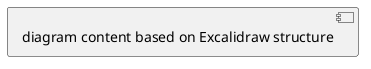

# Excalidraw Converter Skill

## Scope

This skill handles **bidirectional conversion** between any notation/format and Excalidraw JSON:

- **Any Source → Excalidraw JSON**: Convert descriptions, PlantUML, or other formats into Excalidraw diagrams
- **Excalidraw JSON → Any Target**: Parse Excalidraw and output as natural language description or PlantUML

Supported formats:
- Natural language descriptions
- PlantUML syntax
- Excalidraw JSON

This skill does NOT handle:
- File I/O operations (use whiteboard skill for canvas read/write)

## Before You Generate

**BEFORE GENERATING/PARSING ANY ELEMENTS: Read the relevant spec:**

- EXCALIDRAW SPEC:
  - `excalidraw-spec/json-format.md`: Element types, required properties, text bindings
  - `excalidraw-spec/arrows.md`: Routing algorithm, patterns, bindings, staggering
  - `excalidraw-spec/validation.md`: Checklists, validation algorithm, bug fixes

- PLANTUML SPEC (when source/target is PlantUML):
  - `PLANTUML-SPEC.md` 

| If you think...       | Reality                                                |
|-----------------------|--------------------------------------------------------|
| "User said skip docs" | Invalid JSON wastes their time. Read the spec.         |
| "It's urgent"         | Reading spec: 30 sec. Debugging broken output: 5 min.  |
| "I know the format"   | Training data is outdated. These specs are authoritative. |

## Critical Rules

### 1. NEVER Use Diamond Shapes

Diamond arrow connections are broken in raw Excalidraw JSON. Use styled rectangles instead:

| Semantic Meaning | Rectangle Style |
|------------------|-----------------|
| Decision Point | dashed stroke |

### 2. Labels Require TWO Elements

The `label` property does NOT work in raw JSON. Every labeled shape needs:

```json
// 1. Shape with boundElements reference
{
  "id": "my-box",
  "type": "rectangle",
  "boundElements": [{ "type": "text", "id": "my-box-text" }]
}

// 2. Separate text element with containerId
{
  "id": "my-box-text",
  "type": "text",
  "containerId": "my-box",
  "text": "My Label"
}
```

### 3. Elbow Arrows Need Three Properties

For 90-degree corners (not curved):

```json
{
  "type": "arrow",
  "roughness": 0,        // Clean lines
  "roundness": null,     // Sharp corners
  "elbowed": true        // 90-degree mode
}
```

### 4. Arrow Edge Calculations

Arrows must start/end at shape edges, not centers:

| Edge | Formula |
|------|---------|
| Top | `(x + width/2, y)` |
| Bottom | `(x + width/2, y + height)` |
| Left | `(x, y + height/2)` |
| Right | `(x + width, y + height/2)` |

**Detailed arrow routing:** See `excalidraw-spec/arrows.md`

---


## Direction Detection

Determine conversion direction from user input:

**→ Excalidraw JSON** (generating) if user:
- Asks to "create", "generate", "draw", "visualize", "diagram"
- Provides PlantUML code (`@startuml`/`@enduml`)
- Provides a natural language description

**Excalidraw JSON →** (parsing) if user:
- Provides Excalidraw JSON content
- Asks to "describe", "explain", "summarize", "convert to PlantUML"
- Shares canvas content for analysis

---

# Generating Excalidraw JSON

## Source Detection

| Source Contains... | Source Type | Action |
|--------------------|-------------|--------|
| `@startuml`/`@enduml` | PlantUML | Parse PlantUML structure, generate Excalidraw |
| Natural language description | Text | Analyze description, generate Excalidraw |
| Excalidraw JSON | Already Excalidraw | No conversion needed |

## From PlantUML

When source is PlantUML:

1. **Read [PLANTUML-SPEC.md](PLANTUML-SPEC.md)** for syntax reference
2. **Identify diagram type** from content:
   - `start`/`stop` with `:action;` → Activity diagram → Use Activity Diagram Styling
   - `class`/`interface` → Class diagram → Use generic styling
   - `participant` → Sequence diagram → Use generic styling
   - `[*]` transitions → State diagram → Use generic styling
3. **Extract structure**: actors, steps, relationships, conditions
4. **Generate Excalidraw** using appropriate styling below

## From Natural Language

When source is a description:

1. **Detect diagram type** from keywords:

| Description Contains... | Diagram Type | Use Styling |
|------------------------|--------------|-------------|
| "process", "workflow", "activity", "swimlane", "steps", "flow" | Activity/Process | Activity Diagram Styling |
| "class", "object", "inheritance", "UML", "architecture" | Class Diagram | Generic Styling |
| "sequence", "interaction", "message", "timeline" | Sequence Diagram | Generic Styling |
| Generic without clear type | Generic | Generic Styling |

2. **Extract structure** from the description
3. **Generate Excalidraw** using appropriate styling

---

## Activity Diagram Styling

Use for process flows, workflows, and activity diagrams.

### Structure

**Vertical swimlane format:**
- Top-to-bottom flow direction
- Swimlane headers at top identifying actors/systems/stages
- Process boxes in lanes with matching colors
- Straight arrows connecting steps with bound labels

### Headers

Colored rectangles at top identifying each lane:
- Position: y=50, height=50
- Lane spacing: ~220px horizontal
- Style: strokeWidth=2, roughness=0, roundness={type:3}
- Must have bound text element for the label

### Color Palette

Use consistently per lane:

| Lane   | Stroke  | Header Fill | Box Fill (lighter) |
|--------|---------|-------------|---------------------|
| Blue   | #1971c2 | #a5d8ff     | #e7f5ff             |
| Green  | #2f9e44 | #b2f2bb     | #ebfbee             |
| Yellow | #f08c00 | #ffec99     | #fff9db             |
| Red    | #e03131 | #ffc9c9     | #fff5f5             |
| Purple | #9c36b5 | #eebefa     | #f8f0fc             |
| Teal   | #0c8599 | #99e9f2     | #e3fafc             |
| Pink   | #d6336c | #fcc2d7     | #fff0f6             |
| Gray   | #495057 | #dee2e6     | #f8f9fa             |

Assign colors to lanes in order of appearance. Use semantic grouping when obvious (e.g., user-facing=blue, backend=green, external services=yellow).

### Process Boxes

Boxes use the same lane color but with lighter fill:
- Size: 200x70 typical
- First row: y=140
- Row spacing: ~120px vertical
- Style: same strokeColor as lane header, lighter backgroundColor

**Critical: Boxes must declare ALL bound elements:**

### Activity Diagram Shape Reference

Standard shapes for activity diagram constructs:

| Construct             | Excalidraw Shape          | Size   | Notes                                           |
|-----------------------|---------------------------|--------|-------------------------------------------------|
| Decision (branching)  | Rectangle (dashed stroke) | 100x80 | Where flow splits based on condition            |
| Merge (converging)    | Rectangle (dashed stroke) or implicit       | 100x80 | Where paths rejoin; can omit if arrows converge |
| Fork (parallel start) | Thin rectangle            | 400x8  | Bar indicating parallel execution begins        |
| Join (parallel end)   | Thin rectangle            | 400x8  | Bar indicating parallel paths synchronize       |
| Action/Activity       | Rounded rectangle         | 200x70 | `roundness: {type: 3}`                          |
| Start                 | Small ellipse             | 30x30  | Solid black fill                                |
| End/Stop              | Small ellipse             | 30x30  | White fill, thick black stroke                  |

### Fork/Join Bar

Thin horizontal rectangles for parallel flow. Span relevant lanes.

```json
{
  "type": "rectangle",
  "width": 400,
  "height": 8,
  "strokeColor": "#495057",
  "backgroundColor": "#495057",
  "roundness": null
}
```

### Start/End Nodes

Small ellipses to mark flow boundaries.

**Start node** (solid black):
```json
{
  "type": "ellipse",
  "width": 30,
  "height": 30,
  "strokeColor": "#1e1e1e",
  "backgroundColor": "#1e1e1e"
}
```

**End node** (ring effect - white fill, thick stroke):
```json
{
  "type": "ellipse",
  "width": 30,
  "height": 30,
  "strokeColor": "#1e1e1e",
  "backgroundColor": "#ffffff",
  "strokeWidth": 4
}
```

---

## Generic Styling (Non-Activity Diagrams)

For class diagrams, sequence diagrams, and other non-process visualizations:

- Stroke colors: `#1e1e1e` (black), `#e03131` (red), `#2f9e44` (green), `#1971c2` (blue), `#f08c00` (orange)
- Background colors: `transparent`, `#ffc9c9` (light red), `#b2f2bb` (light green), `#a5d8ff` (light blue), `#ffec99` (light yellow)
- Choose colors based on semantic meaning (e.g., classes=blue, interfaces=green, abstract=orange)
- Use consistent spacing and alignment
- Apply appropriate roughness (0=architect, 1=artist, 2=cartoonist) based on context

---

## Output Format

Output the **raw Excalidraw JSON** directly to chat:
- NO markdown code fences
- NO explanation before or after
- Just the JSON object with `elements` array

```
{
  "type": "excalidraw",
  "version": 2,
  "source": "https://excalidraw.com",
  "elements": [...],
  "appState": {"gridSize": null, "viewBackgroundColor": "#ffffff"},
  "files": {}
}
```

## Quick Validation Checklist

Before writing file:
- [ ] Every shape with label has boundElements + text element
- [ ] Text elements have containerId matching shape
- [ ] Multi-point arrows have `elbowed: true`, `roundness: null`
- [ ] Arrow x,y = source shape edge point
- [ ] Arrow final point offset reaches target edge
- [ ] No diamond shapes
- [ ] No duplicate IDs

**Full validation algorithm:** See `excalidraw-spec/validation.md`

---

## Common Issues

| Issue | Fix |
|-------|-----|
| Labels don't appear | Use TWO elements (shape + text), not `label` property |
| Arrows curved | Add `elbowed: true`, `roundness: null`, `roughness: 0` |
| Arrows floating | Calculate x,y from shape edge, not center |
| Arrows overlapping | Stagger start positions across edge |

**Detailed bug fixes:** See `excalidraw-spec/validation.md`

---

## PlantUML ↔ Excalidraw Shape Mapping (Activity Diagrams)

When converting activity diagrams between PlantUML and Excalidraw, use this mapping. Note that PlantUML renders shapes differently than standard UML:

| PlantUML Construct        | PlantUML Renders  | Excalidraw Equivalent           |
|---------------------------|-------------------|---------------------------------|
| `if/then/else` (decision) | Hexagon           | Rectangle (dashed stroke)       |
| `endif` (merge)           | Diamond           | Rectangle (dashed stroke) or implicit             |
| `fork/end fork`           | Bar               | Thin rectangle                  |
| `:action;`                | Rounded rectangle | Rounded rectangle               |
| `start`                   | Filled circle     | Small filled ellipse            |
| `stop`                    | Circle with ring  | Small ellipse with thick stroke |

This mapping applies in both directions:
- **PlantUML → Excalidraw**: Use when generating Excalidraw from PlantUML source
- **Excalidraw → PlantUML**: Use when converting Excalidraw diagrams to PlantUML output

---

# Parsing Excalidraw JSON

## To Natural Language

When user wants a description of Excalidraw content:

1. **Identify diagram type** by examining element patterns:
   - Lane headers with colored boxes → Activity/Process diagram
   - Rectangles with inheritance arrows → Class diagram
   - Time-ordered elements → Sequence diagram

2. **Extract structural information:**
   - Count elements by type
   - Identify groups and frames
   - Map bindings (which elements connect to which)

3. **Output structured description:**

```
**Diagram Type:** [Activity/Class/Sequence/Generic]

**Summary:** [One-sentence overview]

**Structure:**
- [Key structural observations]

**Flow/Content:**
- [Step 1 or Component 1]
- [Step 2 or Component 2]

**Key Elements:**
- [Notable elements, labels, annotations]
```

## To PlantUML

When user wants PlantUML output from Excalidraw:

1. **Read [PLANTUML-SPEC.md](PLANTUML-SPEC.md)** for syntax reference
2. **Identify diagram type** from Excalidraw structure
3. **For activity diagrams**, use the PlantUML ↔ Excalidraw Shape Mapping section above
4. **Map elements to PlantUML syntax:**

| Excalidraw Pattern | PlantUML Output |
|--------------------|-----------------|
| Lane headers + flow boxes + diamonds | Activity diagram with `\|Lane\|` markers |
| Rectangles with class-like text | Class diagram with `class Name {}` |
| Vertical timeline with messages | Sequence diagram with `participant` |
| State boxes with transitions | State diagram with `[*]` and arrows |

5. **Generate PlantUML** with proper syntax:



### Mapping Examples

**Activity diagram:**
- Lane header text → `|Actor Name|`
- Process box text → `:Action text;`
- Conditional branches → `if (condition?) then (yes) ... else (no) ... endif`
- Arrow labels → transition annotations

**Class diagram:**
- Rectangle with sections → `class Name { fields -- methods }`
- Arrow with hollow head → `<|--` (inheritance)
- Arrow with filled diamond → `*--` (composition)

---

## Guidelines

1. **Always read the relevant spec first** - Don't rely on training data
2. **Detect source/target format** from content and user intent
3. **Use appropriate styling** - Activity Diagram Styling for processes, generic for others
4. **Preserve semantics** - Arrow types and relationships matter
5. **Validate bindings** - Both sides must reference each other
6. **Output clean JSON** - No markdown fences, proper formatting
