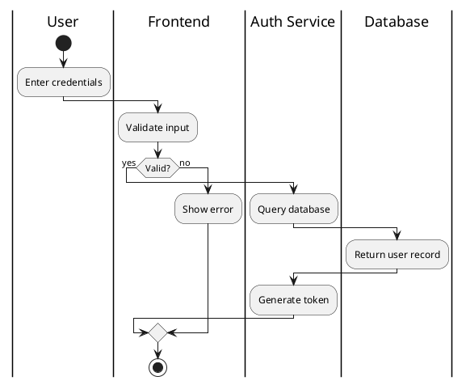
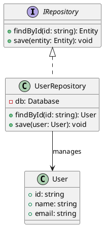
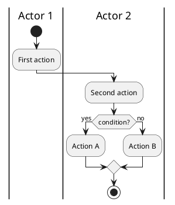
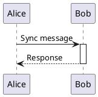
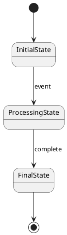
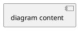
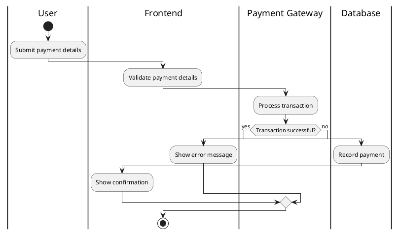
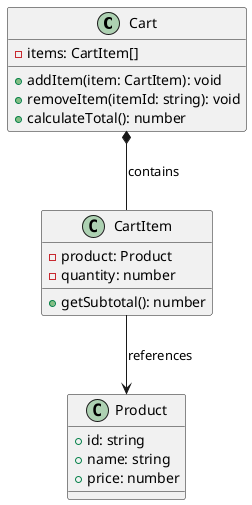

# PlantUML Converter Skill

## Scope

This skill handles **bidirectional conversion** between PlantUML syntax and natural language descriptions:
- **PlantUML → Natural Language**: Parse and describe existing PlantUML diagrams
- **Natural Language → PlantUML**: Convert descriptions into valid PlantUML syntax

This skill does NOT handle:
- Excalidraw conversion (handled by whiteboard:excalidraw skill)
- File I/O operations (reading/writing .puml files - use whiteboard:whiteboard skill)

## Before You Generate

**BEFORE GENERATING ANY PLANTUML: Read the PlantUML spec:**
- [PLANTUML-SPEC.md](PLANTUML-SPEC.md) - Syntax for activity, class, sequence, state diagrams

| If you think...       | Reality                                                    |
|-----------------------|------------------------------------------------------------|
| "User said skip docs" | Invalid syntax wastes their time. Read the spec.           |
| "It's urgent"         | Reading spec: 30 sec. Debugging broken PlantUML: 5 min.    |
| "I know PlantUML"     | Training data is outdated. This spec is authoritative.     |

## Direction Detection

Determine conversion direction from user input:

**PlantUML → Natural Language** if user:
- Provides content with `@startuml`/`@enduml` markers
- Shares PlantUML syntax (e.g., `|Swimlane|`, `class ClassName`, `participant Alice`)
- Asks to "describe", "explain", "summarize" PlantUML code
- Pastes a .puml file content for analysis

**Natural Language → PlantUML** if user:
- Asks to "create", "generate", "convert to PlantUML"
- Provides a description of a process, system, or concept
- Requests a specific diagram type without providing PlantUML code
- Wants to convert from natural language or Excalidraw description

---

# PlantUML → Natural Language

## Parsing Strategy

When analyzing PlantUML syntax:

1. **Identify diagram type** from content structure:
   - `start`/`stop` with `:action;` syntax → Activity diagram
   - `class`/`interface` declarations → Class diagram
   - `participant` declarations → Sequence diagram
   - `[*]` and state transitions → State diagram

2. **Extract actors/participants:**
   - Activity: Look for `|Actor Name|` swimlane markers
   - Class: Extract class/interface names
   - Sequence: Extract participant names
   - State: Extract state names

3. **Trace flow/relationships:**
   - Follow arrows (`->`, `-->`, `<|--`, etc.)
   - Parse control structures (`if`/`else`, `repeat`, `fork`)
   - Identify relationships (inheritance, composition, association)
   - Capture transition conditions and labels

4. **Capture labels and annotations:**
   - Arrow labels (`: message text`)
   - Notes (`note left`, `note right`, `note over`)
   - Conditions in branches and loops
   - Method/field declarations

## Output Format

Provide a clear, structured description:

```
**Diagram Type:** [Activity/Class/Sequence/State]

**Summary:** [One-sentence overview of what the diagram represents]

**Actors/Participants:**
- [Actor 1]: [Role/description]
- [Actor 2]: [Role/description]

**Flow/Structure:**
[Describe the main flow, relationships, or structure in natural language]
1. [Step/Component 1]
2. [Step/Component 2]
3. [etc.]

**Key Elements:**
- [Notable conditions, loops, relationships, or annotations]

**Notes:**
- [Any notes or comments from the diagram]
```

### Example: Activity Diagram

**Input:**


**Output:**
```
**Diagram Type:** Activity Diagram (with swimlanes)

**Summary:** A user authentication workflow showing the interaction between User, Frontend, Auth Service, and Database.

**Actors/Participants:**
- User: Initiates login by providing credentials
- Frontend: Validates input and displays results
- Auth Service: Handles authentication logic and token generation
- Database: Stores and retrieves user records

**Flow/Structure:**
1. User enters credentials
2. Frontend validates the input
3. If input is valid:
   - Auth Service queries the database
   - Database returns user record
   - Auth Service generates authentication token
4. If input is invalid:
   - Frontend displays error message to user

**Key Elements:**
- Conditional branch on input validation
- Cross-system interaction between four distinct actors
- Success path: Token generation
- Failure path: Error display
```

### Example: Class Diagram

**Input:**


**Output:**
```
**Diagram Type:** Class Diagram

**Summary:** A repository pattern implementation for user data management.

**Actors/Participants:**
- IRepository: Interface defining standard repository operations
- UserRepository: Concrete implementation for user data
- User: Entity class representing user data

**Flow/Structure:**
1. IRepository interface defines two methods:
   - findById: Retrieves entity by ID
   - save: Persists entity
2. UserRepository implements IRepository interface
   - Contains private Database field
   - Implements findById to return User objects
   - Implements save to persist User objects
3. User class defines three public fields:
   - id: User identifier
   - name: User's name
   - email: User's email address

**Key Elements:**
- Interface implementation relationship between UserRepository and IRepository
- Association relationship: UserRepository manages User entities
- Private Database dependency in UserRepository
- Public API exposed through IRepository interface
```

---

# Natural Language → PlantUML

## Diagram Type Detection

Analyze the user's description to determine diagram type:

| User Description Contains... | Diagram Type | PlantUML Syntax |
|------------------------------|--------------|-----------------|
| "process", "workflow", "activity", "swimlane", "steps", "flow" | Activity Diagram | `start`, `:action;`, `|lane|`, `stop` |
| "class", "object", "inheritance", "interface", "OOP", "architecture" | Class Diagram | `class`, `interface`, relationships |
| "sequence", "interaction", "message", "timeline", "request/response" | Sequence Diagram | `participant`, `->`, `-->` |
| "state", "transition", "lifecycle", "FSM", "finite state machine" | State Diagram | `[*]`, `State1 --> State2` |

## Conversion Strategy

### Activity Diagrams

1. **Identify actors/systems** from description → Create swimlanes
2. **Extract sequential steps** → Map to `:Action;` syntax
3. **Identify conditionals** → Use `if`/`else`/`endif`
4. **Identify parallel tasks** → Use `fork`/`end fork`
5. **Identify loops** → Use `repeat`/`while`

Structure:


### Class Diagrams

1. **Identify classes/interfaces** → Create class declarations
2. **Extract fields/methods** → Add to class body with visibility
3. **Identify relationships** → Use appropriate arrow syntax
   - Inheritance: `<|--`
   - Composition: `*--`
   - Aggregation: `o--`
   - Association: `-->`
   - Dependency: `..>`

Structure:
```plantuml
@startuml
class ClassName {
  +publicField: Type
  -privateField: Type
  --
  +publicMethod(): ReturnType
  -privateMethod(): void
}

interface IName {
  +method(): void
}

ClassName implements IName
ClassA <|-- ClassB
@enduml
```

### Sequence Diagrams

1. **Identify participants** → Declare with `participant`
2. **Extract interactions** → Map to message arrows
3. **Identify synchronous vs async** → Use `->` vs `->>`
4. **Add activation boxes** if specified → Use `activate`/`deactivate`

Structure:


### State Diagrams

1. **Identify states** → Create state declarations
2. **Extract transitions** → Map to arrows with labels
3. **Identify composite states** → Use `state { }` syntax

Structure:


## Output Format

Output the **raw PlantUML code** wrapped in markdown code fence with `plantuml` language tag:



### Example: Natural Language → Activity Diagram

**Input:**
"Create an activity diagram for a payment processing flow. The user submits payment details, the frontend validates them, then the payment gateway processes the transaction. If successful, the database records the payment and the user receives confirmation. If it fails, the user is shown an error message."

**Output:**


### Example: Natural Language → Class Diagram

**Input:**
"Create a class diagram for a shopping cart system. We have a Cart class that contains CartItem objects. Each CartItem has a reference to a Product and a quantity. The Cart has methods to add items, remove items, and calculate total."

**Output:**


## Guidelines

1. **Always read PLANTUML-SPEC.md first** - Don't rely on training data
2. **Use appropriate diagram type** - Match the description's intent
3. **Keep it simple** - Start with basic syntax, add complexity only if needed
4. **Preserve semantic meaning** - Arrow types matter (inheritance vs association)
5. **Add notes for clarity** - Use `note` syntax when additional context helps
6. **Use swimlanes for multi-actor processes** - Makes flow clearer
7. **Validate syntax mentally** - Check matching `if`/`endif`, `fork`/`end fork`, etc.
8. **Output clean code** - Proper indentation, consistent spacing
